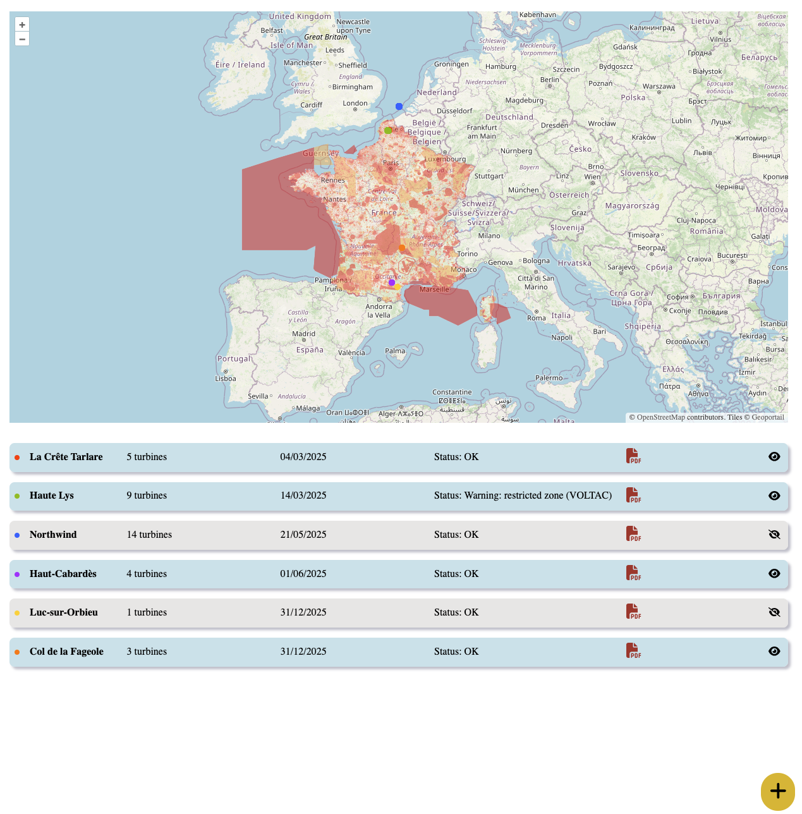

# Mission Planner demo

Ce site est une démo de ce que pourrait être une interface de préparation de mission, utile en interne et pour les clients.

*C'est uniquement une démonstration, donc la plupart des boutons ne fonctionnent pas*.

Lien du site : https://genuine-moxie-0ba72f.netlify.app/

## Techno

Ce site utilise le framework [Astro](https://docs.astro.build/) pour générer un site purement statique. La carte est faite avec [OpenLayers](https://openlayers.org/). 

Déployé sur Netlify.